# Maṉa
Maṉa is a web-based application designed to analyze mental health via social media interactions. The system leverages user-generated comments on posts and tweets to assess emotional well-being. By aggregating social media data through APIs or user uploads, Maṉa employs a fine-tuned RoBERTa model to perform sentiment analysis, classifying interactions as either positive or negative. When negative sentiments prevail, the system activates MaṉaNow—a dynamic questioning AI that conducts an in-depth mental health assessment through a series of targeted questions and ultimately generates a personalized report. In parallel, MaṉaChat provides an instructional conversational interface, powered by the meta llama/Llama-3.2-3B-Instruct model, to offer immediate stress-reduction strategies and mental health guidance. This dual approach not only enhances user engagement but also ensures timely intervention by coupling real-time analysis with supportive resources.

## MHRoberta (a Large Language Model for mental health analysis) (** in progress)

We developed our own model called 'MHRoberta' is Mental Health Roberta model. It is pretrained Roberta transformer based model fine-tunned on Mental Health dataset by adopting PEFT method.

## 🧩 Features
---
### MaṉaChat:  
A standard instructional chatbot that responds to user inquiries (e.g., “How can I reduce my stress levels?”) using the meta-llama/Llama-3.2-3B-Instruct model. 
### MaṉaNow:  
A questioning chatbot that is activated when negative sentiment or concerning patterns are detected. This mode uses the deepseek-ai/DeepSeek-R1 model to dynamically ask a series of assessment questions, and at the end, generate a final report with insights and supportive guidance. 

---

| User flows                  | Description                                                                                 |
|-----------------------------|---------------------------------------------------------------------------------------------|
| **Landing Page**            | Users see a clear landing page with a “Get Started” button.                                |
| **Project Overview Page**   | This page provides details about the project and offers two buttons:                       |
|                             | - “Get Started with MaṉaChat”                                                              |
|                             | - “Get Started with MaṉaNow”                                                               |
| **Interactive Chat Interfaces** | Depending on the chosen mode:                                                          |
|                             | - **MaṉaChat UI**: For standard chat interactions.                                         |
|                             | - **MaṉaNow UI**: For guided mental health assessment (questionnaire) and final report generation. |
| **Data Collection & Analysis** | The system supports comment collection via APIs, allowing users to upload/download their comments for further analysis at the Project Overview UI. |

---
- **MHRoberta Model**: A transformer-based model fine-tuned for mental health analysis tasks.
- **Chatbot Integration**: A FastAPI-powered chatbot that interacts with users, detects their mental state, and provides empathetic responses based on the detected state.
- **Local and Cloud Inference**: Supports both local fallback models and cloud-based inference using Hugging Face's Inference API.
- **Mental State Detection**: Automatically detects mental states from user input and tailors responses accordingly.
---


<details>
<summary>View Installation Steps</summary>

```bash
conda create -n env python=3.13.2
conda activate env
pip install -r requirements.txt
```
</details>

## create an virtual python environment

```bash
conda create -n env.0.0.0 python=3.13.2 -y
```

```bash
conda activate env.0.0.0
```

## install requirements file

```bash
pip install -r requirement.txt
```

## how to run this project

export this huggingface tokens in terminal

```bash
export HUGGINGFACE_TOKEN=your_huggingface_token
export HF_INFERENCE_API_KEY=your_inference_api_key
```

export the project root in terminal

```bash
export PYTHONPATH=/workspaces/MHRoberta-a-LLM-for-mental-health-analysis
```

run the backend file in terminal

```bash
python webapp_setup/chatbot.py
```
## System Architecture


## Sequence Diagram

```mermaid
sequenceDiagram
    actor User as 🧑‍💻 User
    participant Maṉa_UI as 🌐 Maṉa Web App
    participant Social_API as 🔗 Social Media API
    participant Sentiment_Analysis as 📊 Sentiment Analysis (RoBERTa)
    participant MaṉaNow as 🤖 MaṉaNow (DeepSeek-R1)
    participant MaṉaChat as 💬 MaṉaChat (Llama-3.2-3B)
    participant Report_System as 📄 Report Generation

    User ->> Maṉa_UI: Clicks "Get Started" 🚀
    Maṉa_UI ->> Social_API: Fetches user comments 📝
    Social_API -->> Maṉa_UI: Returns comments 📥
    Maṉa_UI ->> Sentiment_Analysis: Analyzes sentiment 🔍
    
    alt Positive Count >= Negative Count 👍
        Maṉa_UI ->> User: Display Sentiment Report ✅
        User ->> MaṉaChat: Starts conversation 💬
        MaṉaChat -->> User: Provides mental health tips 🧘‍♂️
    else Negative Count > Positive Count 🚨
        Maṉa_UI ->> MaṉaNow: Trigger mental health assessment 🔴
        MaṉaNow ->> User: Asks mental health-related questions ❓
        User -->> MaṉaNow: Answers questions 📝
        MaṉaNow ->> Report_System: Generates report 📄
        Report_System -->> User: Displays final mental health report 🏥
    end
    
    User ->> Maṉa_UI: Can download report or seek advice 📥
    User ->> MaṉaChat: Asks for guidance 💡
    MaṉaChat -->> User: Provides personalized mental health support 🤗
```


## Flow chart

```mermaid
graph TD;
    A[User Visits Homepage] -->|Selects MaṉaChat| B(MaṉaChat);
    A -->|Selects MaṉaNow| C(MaṉaNow);
    
    %% MaṉaChat Flow
    B --> D{User Inputs Query};
    D --> E[Retrieve AI-based Response];
    E --> F[Display Mental Health Tips];
    
    %% MaṉaNow Flow
    C --> G{User Uploads Comments or Fetch via API};
    G --> H[Perform Sentiment Analysis];
    H --> I{Negative Sentiment > Positive Sentiment?};
    
    I -- Yes --> J[Trigger MaṉaNow Questions];
    J --> K[User Responds];
    K --> L[Generate Mental Health Report];
    L --> M[Store Report in Database];
    M --> N[Display Report to User];
    
    I -- No --> O[End Session];
```


