```mermaid
sequenceDiagram
    actor User as 🧑‍💻 User
    participant Maṉa_UI as 🌐 Maṉa Web App
    participant Social_API as 🔗 Social Media API
    participant Sentiment_Analysis as 📊 Sentiment Analysis (RoBERTa)
    participant MaṉaNow as 🤖 MaṉaNow (DeepSeek-R1)
    participant MaṉaChat as 💬 MaṉaChat (Llama-3.2-3B)
    participant Report_System as 📄 Report Generation

    User ->> Maṉa_UI: Clicks "Get Started" 🚀
    Maṉa_UI ->> Social_API: Fetches user comments 📝
    Social_API -->> Maṉa_UI: Returns comments 📥
    Maṉa_UI ->> Sentiment_Analysis: Analyzes sentiment 🔍
    
    alt Positive Count >= Negative Count 👍
        Maṉa_UI ->> User: Display Sentiment Report ✅
        User ->> MaṉaChat: Starts conversation 💬
        MaṉaChat -->> User: Provides mental health tips 🧘‍♂️
    else Negative Count > Positive Count 🚨
        Maṉa_UI ->> MaṉaNow: Trigger mental health assessment 🔴
        MaṉaNow ->> User: Asks mental health-related questions ❓
        User -->> MaṉaNow: Answers questions 📝
        MaṉaNow ->> Report_System: Generates report 📄
        Report_System -->> User: Displays final mental health report 🏥
    end
    
    User ->> Maṉa_UI: Can download report or seek advice 📥
    User ->> MaṉaChat: Asks for guidance 💡
    MaṉaChat -->> User: Provides personalized mental health support 🤗
```

# Maṉa

This project focuses on leveraging machine learning and natural language processing (NLP) techniques to analyze mental health-related text data. It includes a fine-tuned version of the Roberta transformer model, named MHRoberta, specifically designed for mental health analysis tasks. The model is trained using the PEFT (Parameter-Efficient Fine-Tuning) method on a mental health dataset.

## MHRoberta (a Large Language Model for mental health analysis)

We developed our own model called 'MHRoberta' is Mental Health Roberta model. It is pretrained Roberta transformer based model fine-tunned on Mental Health dataset by adopting PEFT method.

### Key Features

- **MHRoberta Model**: A transformer-based model fine-tuned for mental health analysis tasks.
- **Chatbot Integration**: A FastAPI-powered chatbot that interacts with users, detects their mental state, and provides empathetic responses based on the detected state.
- **Local and Cloud Inference**: Supports both local fallback models and cloud-based inference using Hugging Face's Inference API.
- **Mental State Detection**: Automatically detects mental states from user input and tailors responses accordingly.

## create an virtual python environment

```bash
conda create -n env.0.0.0 python=3.13.2 -y
```

```bash
conda activate env.0.0.0
```

## install requirements file

```bash
pip install -r requirement.txt
```

## how to run this project

export this huggingface tokens in terminal

```bash
export HUGGINGFACE_TOKEN=your_huggingface_token
export HF_INFERENCE_API_KEY=your_inference_api_key
```

export the project root in terminal

```bash
export PYTHONPATH=/workspaces/MHRoberta-a-LLM-for-mental-health-analysis
```

run the backend file in terminal

```bash
python webapp_setup/chatbot.py
```

